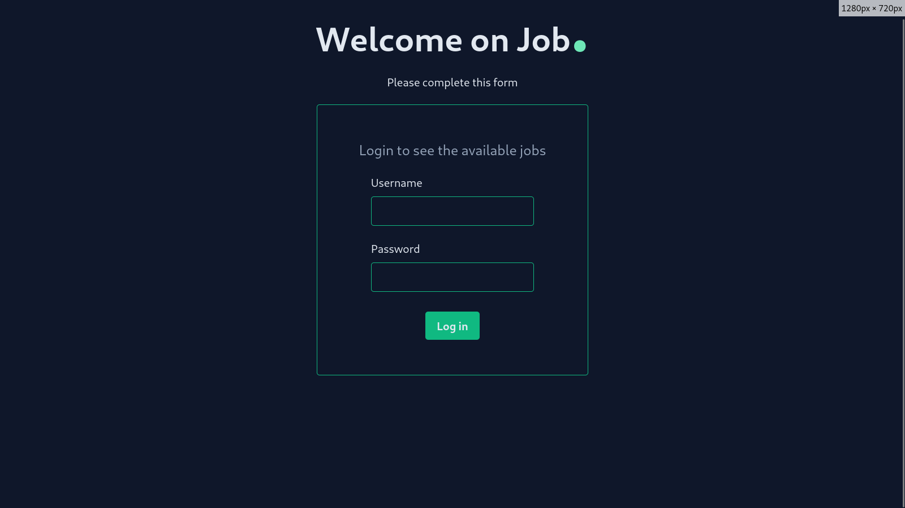

# Jobboard_Vue



## :information_source: About  

This is a piece of a futur Jobboard app (front-end only) made using Vue 3,  

my new tool JavaScript for end of August 2024


## :wrench: Tools
- [Vue 3.4.29](https://vuejs.org/ "Vue official website")
- [Vue Router 4.4.3](https://router.vuejs.org/ 'Vue Router official website')
- [Tailwindcss 3.4.10](https://tailwindcss.com/ "Tailwindcss official website")
- [Vite 5.3.1](https://vitejs.dev/ "Vite official website")


## :inbox_tray: Setup for contributions
1. Open a terminal and paste these lines
s
```bash
git clone git@github.com:loickcherimont/job-vue
```

2. Go in the project , fetch all dependencies and run it

```bash
cd job-vue
npm i
npm run dev
```

3. Welcome on the login page

## :warning: Prerequisites
To run correctly this project, you'll need Vue Router : [Vue Router 4.4.3](https://router.vuejs.org/ 'Vue Router official website')

## :thinking: How does it run ?
This is a simple jobboard app.  

User can connect to the app using form,  

and check all available jobs.

> [!NOTE]
> A better version with more features is coming... 🏗️

## :test_tube: Features
- Prevent user to login without authentication (Go)
- Create a signup session
- Redesign the responsive
- Create a page to display the entire post
- Classic refacto!


## :key: License

Developed by Loick Cherimont  

Under MIT License  

Last edition : 2024-09-01

